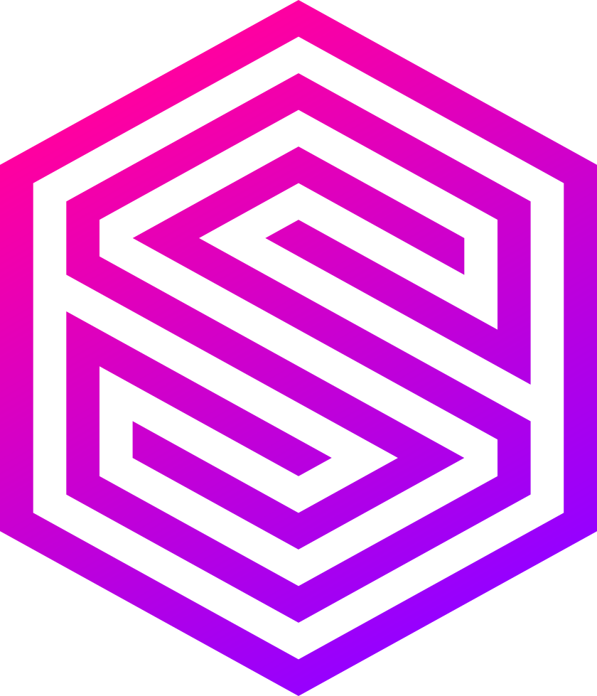

  <h1>Hi, I'm Hendric
    
  </h1>

<picture>
  <source media="(prefers-color-scheme: dark)" srcset="https://raw.githubusercontent.com/hendric-dev/hendric-dev/refs/heads/output/github-contribution-grid-snake-dark.svg" />
  <source media="(prefers-color-scheme: light)" srcset="https://raw.githubusercontent.com/hendric-dev/hendric-dev/refs/heads/output/github-contribution-grid-snake.svg" />
  
</picture>

## About Me

- 💻 Development Lead
- 💖 Tech!
- 👨‍💻 Working at [**LYNQ**TECH](https://www.lynq.tech/)

## Most Loved Tools

My personal awesome list of tools/frameworks/languages.

#### UI

  

    
    <a href="https://dioxuslabs.com/">Dioxus</a>
  

  

    
    <a href="https://vuejs.org/">Vue.js</a>
  

#### Languages

  

    
    <a href="https://www.rust-lang.org/">Rust</a>
  

#### Databases

  

    
    <a href="https://spacetimedb.com/">SpacetimeDB</a>
  

  

    
    <a href="https://surrealdb.com/">SurrealDB</a>
  

#### Observability

  

    
    <a href="https://grafana.com/">Grafana</a>
  

  

    
    <a href="https://opentelemetry.io/">OpenTelemetry</a>
  

  

    
    <a href="https://vector.dev/">Vector</a>
  

#### Testing

  

    
    <a href="https://playwright.dev/">Playwright</a>
  

  

    
    <a href="https://vitest.dev/">Vitest</a>
  

#### Tools

  

    
    <a href="https://oxc.rs/">Javascript Oxidation Compiler</a>
  

  

    
    <a href="https://tanstack.com/">Tanstack</a>
  

  

    
    <a href="https://vitepress.dev/">VitePress</a>
  

